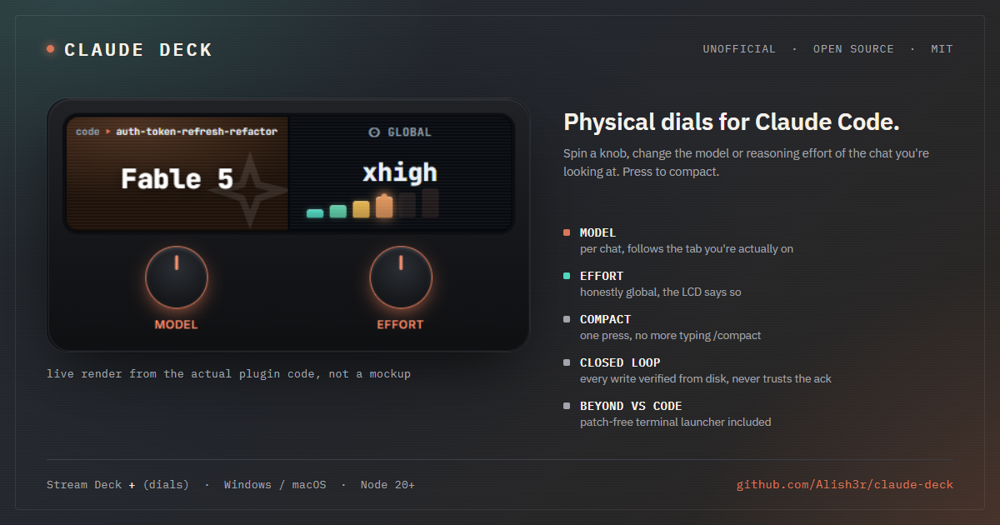
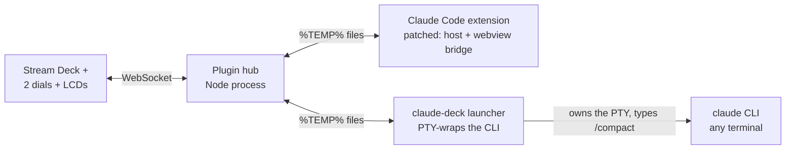
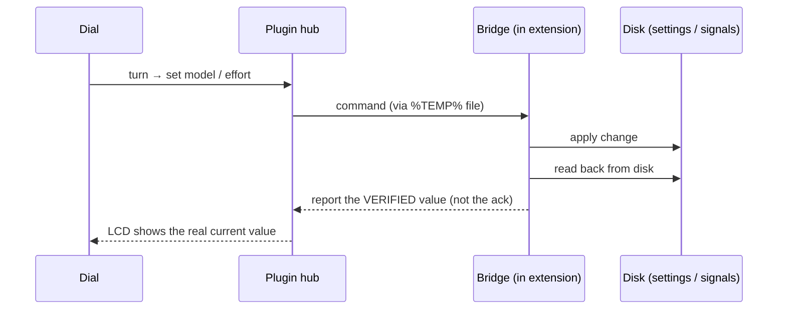
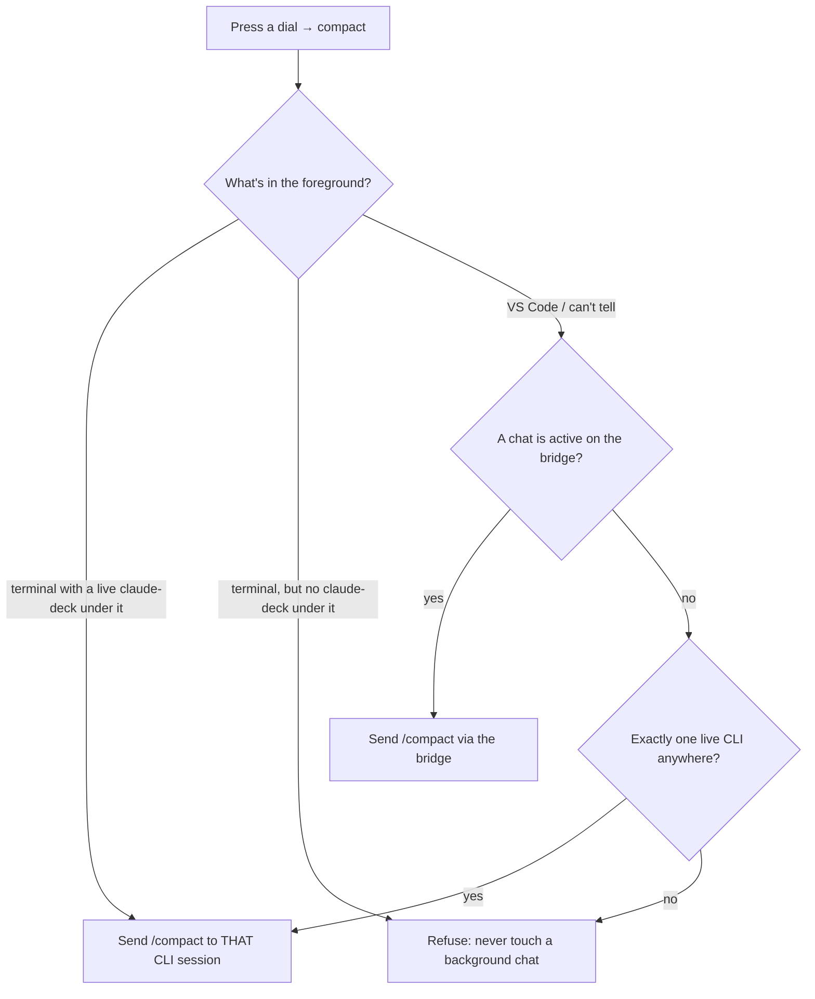

# Claude Deck

Physical Stream Deck dials for the Claude Code VS Code extension. Spin a knob, change the model or the reasoning effort on whatever chat you're looking at. Press the dial, it runs `/compact`. That's it, that's the pitch.

<p align="center">
  
  <br>
  <sub>The dial render is straight from the real plugin code, not a mockup.</sub>
</p>

## What it does

Two dials:

- **Dial 1, Model.** Spins the model of the chat tab you're currently looking at.
- **Dial 2, Effort.** Spins reasoning effort: low → medium → high → xhigh → max.

Press either dial to send `/compact` and shrink the conversation. The little screens show current model and effort so you're not guessing.

That's the whole idea. No menus, no typing `/model` fifteen times a day.

The press action is configurable per dial in Stream Deck settings: model dial press defaults to `/compact` (or resync), effort dial press defaults to toggle-thinking (or resync).

## Features

- **Model is per-chat.** Claude Code's model setting lives per-conversation, not globally, so the dial follows it: turn the knob and only the chat you're looking at changes model. Switch tabs, the dial re-reads and shows *that* chat's model, never carries the old tab's value over.
- **Effort is honestly global.** Reasoning effort isn't stored per-chat in Claude Code, it's one value in `~/.claude/settings.json`. Rather than fake a per-chat effort dial, this one is upfront about being ⊙GLOBAL, the LCD literally says so. Didn't want to lie to you with a UI.
- **Multiple VS Code windows and chat tabs.** You can have several VS Code windows open, each with several chat tabs. The dial targets the real active tab (`mgr.activeSessionId`), not a "focused" flag, that one lags and can point at a tab you already clicked away from. Turning the dial always writes to the chat you're actually looking at, wherever it is.
- **Closed-loop, never trust the ack.** Claude Code's own API can return `ok: true` for a change that didn't actually persist. Classic. Every write here is verified by reading the value back from disk afterward, the LCD shows what's really there, not what a promise claimed.
- **Not limited to VS Code.** The dials need the VS Code extension, that's where model and effort actually live. But the Compact press also works standalone in any terminal running the `claude` CLI (iTerm2, Terminal.app, Windows Terminal, cmd, PowerShell), through a patch-free PTY launcher. No VS Code, no patched extension, nothing to install into the editor.
- **Refuses instead of guessing.** Compact never fires on a running turn or a permission prompt, never sends OS-level keystrokes, and never touches a background chat it can't positively identify. If it can't tell which session you mean, it does nothing rather than compact the wrong one.
- **Windows today, macOS experimental.** The dial logic and the launcher are cross-platform in principle (plain Node + a VS Code extension patch), but the prebuilt plugin ships a Windows-only native image library, so as-is it runs on Windows. macOS needs a rebuild and hasn't been tested, see [Maturity](#maturity-honest-version).

## Read this first

Unofficial. Not affiliated with or endorsed by Anthropic or Elgato.

Claude Code has no public API for model or effort. So this applies a local, **reversible** patch to your own installed copy of the extension, the copy already on your disk. It's reverse-engineered and version-specific. It **will** break when the extension updates, and an auto-update silently removes the patch. When that happens, you just re-apply. Ask me how many times I've done that.

Modifying the extension may go against Anthropic's terms. You're responsible for your own use. This repo never contains or redistributes Anthropic's code, the patcher only rewrites the bundle that's already installed on your machine.

## Requirements

- A Stream Deck **with dials** (Stream Deck +). Knob-only decks can't drive it.
- VS Code with the Claude Code extension.
- Node 20+.
- Windows. macOS is experimental (see Maturity below), Linux untested.

## Maturity: honest version

- **Model + effort dials in VS Code:** work, verified on real hardware.
- **The Compact press** (both the VS Code bridge and the terminal launcher): newer, experimental. Don't expect it to be as solid yet.
- **macOS / Linux:** experimental. The dial logic and launcher are cross-platform, but the prebuilt plugin bundles a Windows-only native image binary (`sharp` win32-x64), so the packaged bundle only loads on Windows. Running it on a Mac means rebuilding with the darwin binary, which I haven't done or tested yet. Contributions welcome.

I'd rather tell you that up front than have you find out the hard way.

## How it works

Three isolated parts. They don't depend on each other more than they have to.



**1. The patch (`patch/`)** injects a small bridge into the extension's host and webview bundles. It reads the real running model and effort, applies changes, and relays over the filesystem (`%TEMP%`), because the webview's content-security-policy blocks websockets. So no socket to talk over. Filesystem it is.

Every write is closed-loop: write → read back from disk → verify. The extension's own success ack has been observed to lie, it says `ok` when the change didn't persist. So I don't trust the ack, I trust the readback.



**2. The Stream Deck plugin (`plugin/`)** is a Node process. Draws the two dials and their screens, routes turns and presses to the bridge, works out which chat tab is focused.

**3. The launcher (`launcher/`)** is optional and patch-free. Makes the Compact press work outside VS Code. You run `claude-deck` instead of `claude`. It PTY-wraps the CLI transparently, watches for Claude going idle, and types `/compact` into its own terminal file descriptor. Yes it's a bot typing at a CLI so you don't have to. No, it doesn't touch your OS keyboard, that's a hard line I drew on purpose.



Never OS-level keystrokes. Only fires when Claude is idle. Press during a running turn or a permission prompt and it refuses instead of misfiring. If it can't tell which session you mean, it refuses instead of guessing, so it never compacts a background VS Code chat by accident. Paranoid on purpose.

## Install

```sh
git clone https://github.com/Alish3r/claude-deck
cd claude-deck
npm run setup
```

That's the whole install: it finds your Claude Code extension, installs the plugin's
dependencies, applies the patch, and builds + side-loads the Stream Deck plugin, skipping
any step that's already done, so it's safe to re-run. It prints a clear error and stops if
something's missing (e.g. the Claude Code extension isn't installed) instead of failing
partway through.

Two steps are GUI-only and can't be scripted:

- In VS Code: **Developer: Reload Window**.
- In the Stream Deck app: add the **Model** and **Effort** dial actions.

If the plugin doesn't show up:

```sh
npx @elgato/cli restart com.alisher.claude-deck
```

### Installing via Claude Code (or another coding agent)

Paste this repo's URL into a Claude Code chat and ask it to set it up, `npm run setup` is
the only command it needs to run. The script is non-interactive, idempotent, and exits with
a specific error message if a prerequisite is missing, so an agent can act on the output
without guessing. Meta, I know, using Claude Code to install a plugin for Claude Code.

## Using it outside VS Code

The dials need the VS Code extension, that's where model and effort actually live. But the Compact press works in any terminal running the `claude` CLI, through the launcher, no patching:

```sh
cd launcher
npm install
node bin/claude-deck.js    # or put it on PATH as claude-deck
```

Works in iTerm2, Terminal.app, Windows Terminal, cmd, PowerShell. Launch `claude-deck` there and keep it in the foreground when you press.

Point it at a specific binary:

```sh
CLAUDE_DECK_CLAUDE_BIN=/path/to/claude
```

Other editors (Cursor and the rest): the dials won't work, they need Anthropic's VS Code extension specifically. But the terminal Compact launcher will, since it just wraps the CLI.

## Reverse-engineered facts worth stating

These may drift with versions. As of what I've looked at:

- **Model is per-channel**, so a per-chat model dial is actually possible.
- **Effort is global** (`~/.claude/settings.json` → `effortLevel`). So the effort dial is honestly global, not faking per-chat. Didn't want to pretend otherwise.
- The effort enum is `low | medium | high | xhigh`. `max` maps to `enableUltracode()`.
- The real running model comes from `currentMainLoopModel`. The picker's `modelSelection` lags after `/model`, don't read that one.
- Hidden webview panels add ~2s latency, because their timers get throttled when the panel isn't visible. VS Code being VS Code.

## Uninstall / revert

```sh
node patch/cli.mjs revert   # restores pristine bundles, verified
```

Then **Developer: Reload Window** in VS Code, and remove the plugin from the Stream Deck app.

## Development

```sh
npm test                    # plugin + patch
cd launcher && npm test     # launcher
```

The launcher tests run against real captured Claude TUI frames, so the idle detector is validated against the actual interface, not a guessed one, it keys off a `✨ ready` footer, a `…` working line, and `❯ 1.` permission menus.

More detail lives in:

- [docs/HOW-IT-WORKS.md](docs/HOW-IT-WORKS.md), the deep dive
- [docs/STREAMDECK-SDK.md](docs/STREAMDECK-SDK.md), Stream Deck SDK notes I verified while building this

Contributions welcome. Especially two things:

- **Version-anchor updates** when a new Claude Code release moves the patch targets.
- **Linux and macOS field reports**, I've only run this on Windows so far.

## License

MIT, plus a [Commons Clause](LICENSE). Read, use, modify, self-host, whatever you want, for free. The one thing you can't do without asking is sell it, resell it, or build a paid product/service around it. Want to do that? Open an issue, let's talk, I'm not trying to block you, I just want to be part of it.

It does not include, modify-in-repo, or redistribute Anthropic's or Elgato's software. The patcher only rewrites the bundle already installed on your machine.
