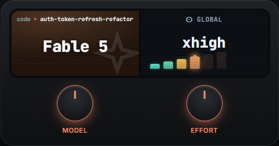
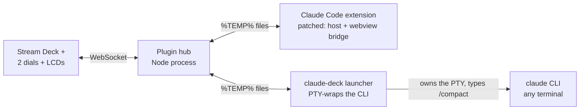
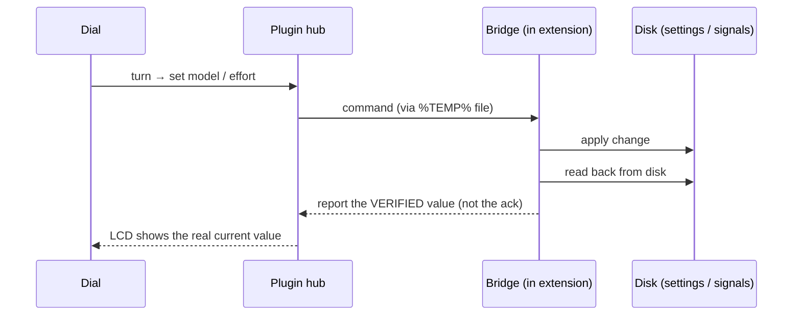

# Claude Deck

Physical Stream Deck dials for the Claude Code VS Code extension. Spin a knob, change the model or reasoning effort of the chat you're looking at. Press a dial to `/compact`.

<p align="center">
  
  <br>
  <sub>The two dial screens, rendered by the real plugin code — model on the left (headed by the active chat name), global effort (⊙) on the right.</sub>
</p>

## What it does

Two dials:

- **Dial 1 — Model.** Spins the model of the chat tab you're currently looking at.
- **Dial 2 — Effort.** Spins reasoning effort: low → medium → high → xhigh → max.

Press either dial to send `/compact` and shrink the conversation. The little screens on the dials show the current model and effort so you don't have to guess.

That's the whole idea. No menus, no typing `/model` every time.

The press action is configurable in the Stream Deck settings for each dial: the model dial press defaults to `/compact` (or resync), the effort dial press defaults to toggle-thinking (or resync).

## Read this first

Unofficial. Not affiliated with or endorsed by Anthropic or Elgato.

Claude Code has no public API for model or effort. So this applies a local, **reversible** patch to your own installed copy of the extension — the copy already on your disk. It's reverse-engineered and version-specific. It **will** break when the extension updates, and an auto-update silently removes the patch. When that happens you just re-apply.

Modifying the extension may go against Anthropic's terms. You're responsible for your own use. This repo never contains or redistributes Anthropic's code — the patcher rewrites the bundle that's already installed on your machine.

## Requirements

- A Stream Deck **with dials** (Stream Deck +). Knob-only decks can't drive it.
- VS Code with the Claude Code extension.
- Node 20+.
- Windows or macOS. Only exercised on Windows so far.

## Maturity — honest version

- **Model + effort dials in VS Code:** work, verified on real hardware.
- **The Compact press** (both the VS Code bridge and the terminal launcher): newer, experimental. Don't expect it to be as solid yet.

I'd rather tell you that up front than have you find out.

## How it works

Three isolated parts. They don't depend on each other more than they have to.



**1. The patch (`patch/`)** injects a small bridge into the extension's host and webview bundles. It reads the real running model and effort, applies changes, and relays over the filesystem (`%TEMP%`) — because the webview's content-security-policy blocks websockets, so there's no socket to talk over.

Every write is closed-loop: write → read back from disk → verify. The extension's own success ack has been observed to lie — it says `ok` when the change didn't persist. So I don't trust the ack, I trust the readback.



**2. The Stream Deck plugin (`plugin/`)** is a Node process. It draws the two dials and their screens, routes turns and presses to the bridge, and works out which chat tab is focused.

**3. The launcher (`launcher/`)** is optional and patch-free. It makes the Compact press work outside VS Code. You run `claude-deck` instead of `claude`. It PTY-wraps the CLI transparently, watches for Claude going idle, and types `/compact` into its own terminal file descriptor.


Never OS-level keystrokes. It only fires when Claude is idle. Press during a running turn or a permission prompt and it refuses instead of misfiring. If it can't tell which session you mean, it refuses instead of guessing — so it never compacts a background VS Code chat by accident.

## Install

```sh
git clone https://github.com/Alish3r/claude-deck
cd claude-deck
npm install
```

Apply the patch:

```sh
node patch/cli.mjs apply
node patch/cli.mjs status   # should show the __CLAUDE_DECK_v1__ markers
```

Build the plugin:

```sh
cd plugin
npm install
node build.mjs             # bundles + copies into the Stream Deck plugins dir
```

Then:

- In VS Code: **Developer: Reload Window**.
- In the Stream Deck app: add the **Model** and **Effort** dial actions.

If the plugin doesn't show up:

```sh
npx @elgato/cli restart com.alisher.claude-deck
```

## Using it outside VS Code

The dials need the VS Code extension — that's where model and effort actually live. But the Compact press works in any terminal running the `claude` CLI, through the launcher, no patching:

```sh
cd launcher
npm install
node bin/claude-deck.js    # or put it on PATH as claude-deck
```

Works in iTerm2, Terminal.app, Windows Terminal, cmd, PowerShell. Launch `claude-deck` there and keep it in the foreground when you press.

Point it at a specific binary:

```sh
CLAUDE_DECK_CLAUDE_BIN=/path/to/claude
```

Other editors (Cursor and the rest): the dials won't work, they need Anthropic's VS Code extension specifically. But the terminal Compact launcher will, since it just wraps the CLI.

## Reverse-engineered facts worth stating

These may drift with versions. As of what I've looked at:

- **Model is per-channel** — so a per-chat model dial is actually possible.
- **Effort is global** (`~/.claude/settings.json` → `effortLevel`). So the effort dial is honestly global, not faking per-chat. I didn't want to pretend otherwise.
- The effort enum is `low | medium | high | xhigh`. `max` maps to `enableUltracode()`.
- The real running model comes from `currentMainLoopModel`. The picker's `modelSelection` lags after `/model`, so don't read that one.
- Hidden webview panels add ~2s latency, because their timers get throttled when the panel isn't visible.

## Uninstall / revert

```sh
node patch/cli.mjs revert   # restores pristine bundles, verified
```

Then **Developer: Reload Window** in VS Code, and remove the plugin from the Stream Deck app.

## Development

```sh
npm test                    # plugin + patch
cd launcher && npm test     # launcher
```

The launcher tests run against real captured Claude TUI frames, so the idle detector is validated against the actual interface, not a guessed one — it keys off a `✨ ready` footer, a `…` working line, and `❯ 1.` permission menus.

More detail lives in:

- [docs/HOW-IT-WORKS.md](docs/HOW-IT-WORKS.md) — the deep dive
- [docs/STREAMDECK-SDK.md](docs/STREAMDECK-SDK.md) — Stream Deck SDK notes I verified while building this

Contributions welcome. Especially two things:

- **Version-anchor updates** when a new Claude Code release moves the patch targets.
- **Linux and macOS field reports** — I've only run this on Windows so far.

## License

[MIT](LICENSE) for the code in this repo.

It does not include, modify-in-repo, or redistribute Anthropic's or Elgato's software. The patcher only rewrites the bundle already installed on your machine.
