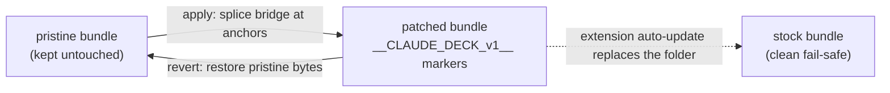
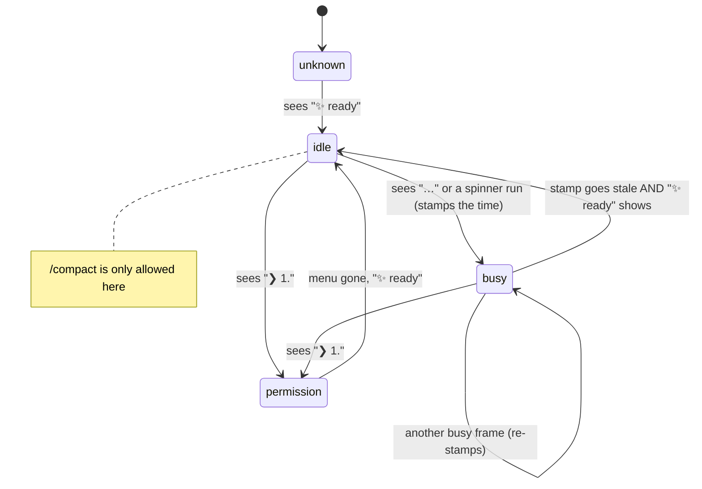

<!-- markdownlint-disable -->

# How Claude Deck works

This is the long version of the README. If you just want to use the thing, read the README. If you want to know why it's built the way it is, and where it can break, keep reading.

## 1. The problem

Claude Code's VS Code extension has no public API for the model or the reasoning effort. There is no command, no setting you can script, nothing. The only way to change them is to click inside the webview — open the picker, pick a model, or open the effort menu and pick a level.

I wanted a physical dial for that. Turn a knob, model changes. Turn another knob, effort changes. To do that from a Stream Deck I need something in between the hardware and the extension, and the extension gives me no seam to hook into.

So the only path was to instrument the extension itself. Not ideal, but that's the reality of a closed webview with no API.

## 2. Why a patch, and why it's reversible

The extension ships as a minified bundle — a host side (`extension.js`, runs in the extension host) and a webview side (`index.js`, runs in the chat UI). Both are minified, so there are no nice names to grab onto.

I inject a small bridge by string-anchoring on stable code landmarks — bits of code that don't change between builds — and splicing my code in next to them. Everything I add is marked with `__CLAUDE_DECK_v1__` so it's detectable and removable. `patch/cli.mjs` does the work: `apply`, `revert`, `status`, `verify`. A pristine copy of the original bundle is kept untouched, so `revert` puts back the exact original bytes, not my idea of what the original was.

This is version-specific and I don't pretend otherwise. When Anthropic re-minifies on a new release the anchors move and the patch won't apply. And an extension auto-update wipes the patch entirely — the whole folder gets replaced. That sounds bad but it's actually a clean fail-safe: worst case you're back to stock Claude Code, nothing broken, you just re-apply.

## 3. Talking to the webview without a socket

The obvious way to talk to the bridge would be a websocket. Can't do it. The webview runs under a content-security-policy that blocks websockets and outbound fetch. So the bridge inside the webview has no way to open a socket to my plugin.

So it relays over the filesystem instead. Small JSON files in the OS temp dir (`%TEMP%`). The plugin writes command files, the bridge writes result files, both sides poll for the other's files. It's ugly — polling files in a temp folder like it's 2003 — but it's the one channel CSP doesn't close. You can't stop a webview from touching disk through the extension host, so that's the door I use.

## 4. Closed-loop writes — trust the readback, not the ack

Here's a trap. When you set the effort, the extension's own call returns `ok: true` — even in cases where the value did not actually persist to `~/.claude/settings.json`. So the ack lies to you. If you trust it, the dial says "high" and the setting on disk is still "medium".

So every mutation is closed-loop: write → read back from disk → verify the real value. The dial LCD shows the verified value from disk, never the optimistic ack. Same discipline for the model. If the readback doesn't match what I asked for, that's a failure, no matter what the call returned.

## 5. Which chat is "focused"

You can have several VS Code windows open, each with several chat tabs. The model is per-channel — per chat — so the dial can't just set "the model" globally. It has to target the chat you're actually looking at right now.

The plugin tracks the active session for that: the real active tab, `mgr.activeSessionId`. Not a "focused" flag, because that one lags — it can point at a tab you already clicked away from. `activeSessionId` is the tab you're really in, so that's the one the dial writes to.

## 6. The signals that actually matter

A few things I had to learn by reading the runtime, not the docs:

- **Model:** `currentMainLoopModel` is the real running model. `modelSelection` (what the picker shows) lags right after a `/model` switch, so if you read the picker you get the old value. I read `currentMainLoopModel`.
- **Effort:** it's global, lives in `~/.claude/settings.json` under `effortLevel`. The enum is `low | medium | high | xhigh`. And the one shown as `max` in the UI is really `enableUltracode()` under the hood — not a fifth enum value, a separate switch.
- **Latency:** hidden webview panels throttle their timers. A backgrounded chat can add around 2s before it answers the bridge, so the bridge tolerates slow round-trips instead of treating a slow reply as a dead one.

## 7. The terminal launcher (no patch)

Not everything runs in VS Code. Sometimes you're in a plain terminal with the `claude` CLI. There's no webview there to patch, so this side works differently.

`claude-deck` PTY-wraps the real `claude` CLI. It's a transparent passthrough — it spawns claude under a pseudo-terminal and pipes everything both ways, so your session looks and feels identical, you wouldn't know it's there. While it wraps, it registers a marker file in `%TEMP%` so the plugin knows a live CLI session exists and which process it is.

When a Compact press is routed to this session, the launcher writes `/compact\r` straight into the PTY file descriptor it owns. That's it. No OS keystroke injection, no SendKeys, no touching other windows. It only writes into the fd of the process it started itself.

## 8. Idle detection — the hard part

The launcher must only send `/compact` when Claude is actually idle. Never mid-turn, and never while a permission prompt is up — because then `/compact` would answer the prompt with garbage.

My first mistake was building the detector against my mental model of the TUI. I assumed an `esc to interrupt` footer, a `| >` input box, braille spinners — the stuff I remembered seeing. Then I captured REAL frames from claude 2.x and none of that was true.

What the actual TUI shows:

- **idle** — a `✨ ready` status footer
- **busy** — a gerund working line ending in an ellipsis `…`, plus a run of sparkle-spinner glyphs
- **permission menu** — `❯ 1.` numbered options

One subtlety bit me hard. A just-finished turn prints something like `✻ Churned for 3s` — that's a single spinner glyph sitting on a done line. That must NOT read as busy. So "busy" keys off the `…` ellipsis or a run of spinner glyphs, never a lone one.

The bigger thing: busy is detected in TIME, not by buffer presence. The bytes of the old footer stay in the scrollback buffer after the turn ends. So a naive "is the busy footer somewhere in the window" check would latch busy forever — the text never leaves the buffer. Instead, each frame that shows a busy signal stamps a timestamp, and the state is "busy" only while that stamp is recent. Old stamp, no fresh busy frame, back to idle.

The detector is validated against the real captured frames in `launcher/fixtures/`, with fail-loud tests — if a fixture that should read idle reads busy, the test screams, it doesn't shrug.

## 9. Compact routing — refuse rather than misfire

A Compact press has to decide where `/compact` goes, and the wrong answer is expensive — you don't want to compact the wrong conversation.

The logic:

- Foreground window is a terminal with a live `claude-deck` process under it (checked by walking the process tree) → send to that CLI session.
- Foreground is a terminal with **no** claude-deck under it → REFUSE. It will not silently reach past your terminal and compact a background VS Code chat.
- Otherwise (VS Code focused, or can't tell what's in front) → send to the bridge if a chat is active; or to the sole live CLI if there's exactly one; else refuse.

The default is always refuse. The worst acceptable outcome here is "nothing happened, type `/compact` yourself" — never "it compacted the wrong conversation." When in doubt it does nothing, on purpose.

## 10. What's solid and what isn't

Straight, no marketing:

- **Model + effort dials in VS Code** — verified on real hardware. This is the part I use every day and trust.
- **The Compact press** — newer, experimental. The routing and the idle detector are tested against captured frames, but it hasn't had the same mileage. Treat it as a beta and don't be surprised if a TUI change on Anthropic's side needs new fixtures.

That's the whole thing. It's a patch plus some files in a temp folder plus a PTY wrapper. Nothing clever, just careful about where it can go wrong.
